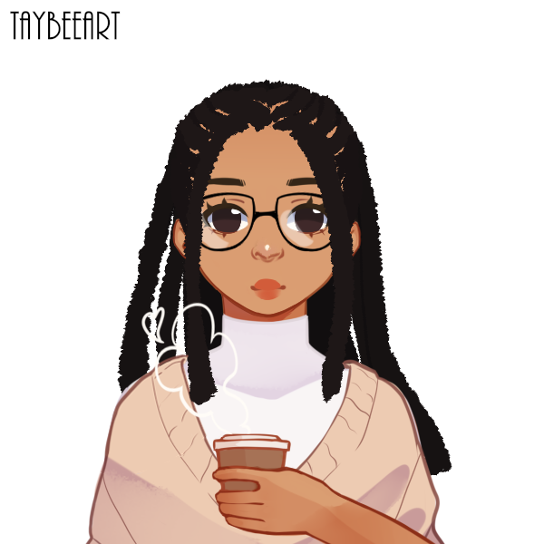

### 🎓 Student
  Analysis and systems development, Descomplica. 
   Oracle next education, Oracle + Alura.
    
### 💻 Interests
 Web Development
    UX/UI Design

<!-- contact -->

<h3>📫 Let's talk</h3>
  
  
  

<!-- pallete -->

<!-- languages -->

  

<!---
**flaviarafaelle/flaviarafaelle** is a ✨ _special_ ✨ repository because its `README.md` (this file) appears on your GitHub profile.
--->
